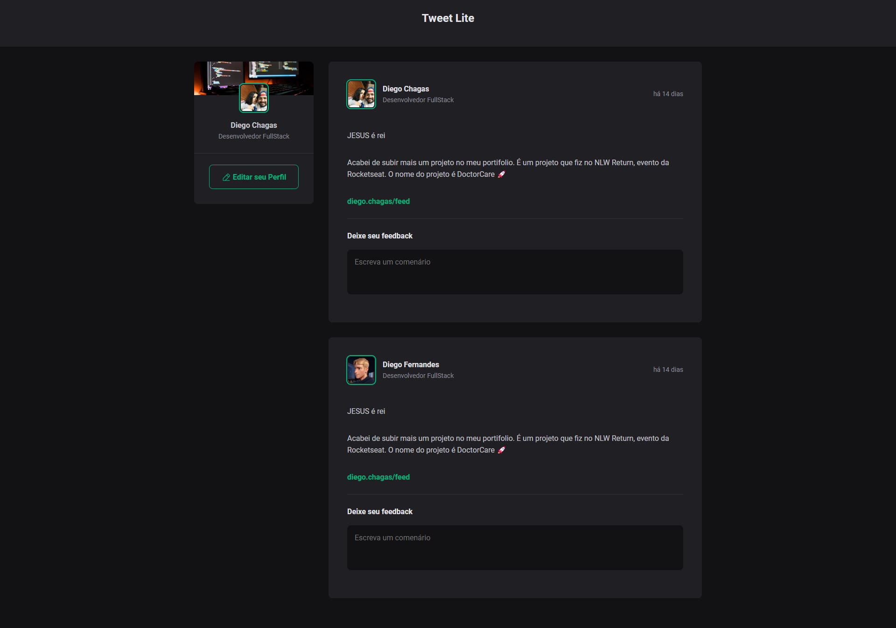

 ## 💻  Tweet Lite

### 🔥 Introdução
O Tweet Lite é uma plataforma colaborativa que permite que os usuários compartilhem posts e recebam feedback através de comentários construtivos. È um projeto ainda em construção que recebera algumas atualizações futuras.





 ## :rocket: Tecnologias

Esse projeto foi desenvolvido com as seguintes tecnologias:

✔️Javascript

✔️React-vite

✔️Styled-components

✔️Phosphor Icons

✔️Date-Fns


## ⚙ Configuração

```
- $ git clone https://github.com/diegofchagas/tweetLite.git

- Para instalar as dependências:
> npm i

- Vá para a pasta do projeto

- Para iniciar a aplicação:
> npm run dev
```

### 🆙 Atualizações futuras

- Criar uma api fake para consumidor os dados de usuários
- Trazer a funcionalidade para o btn "editar perfil"

## Desenvolvedor 
<span style="font-size: larger;">**Diego Chagas**</span>
